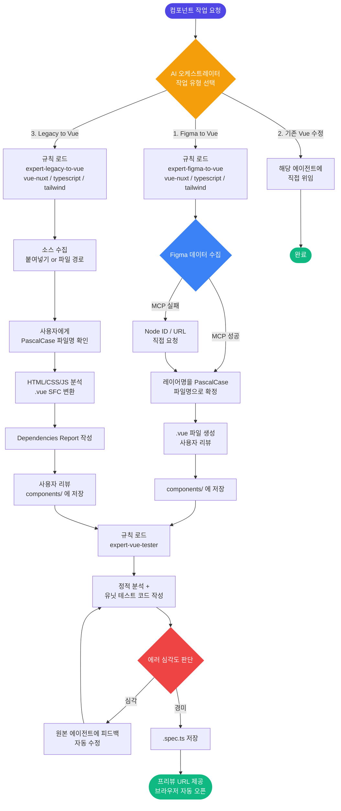

# GoodRich Web-builder: UXD Team AI Component Workflow

굿리치 UX디자인팀의 웹빌더 Figma 디자인을 고품질의 Vue 컴포넌트로 자동 변환하고 브라우저에서 즉시 확인할 수 있는 AI 기반 개발 환경입니다.

---

## 🚀 시작하기 (Getting Started)

> 처음 사용하는 분들은 아래 순서대로 따라 하시면 됩니다.

### 1단계: 저장소 다운로드 (클론)

터미널(명령 프롬프트)을 열고 아래 명령어 중 하나를 실행하세요.

**방법 A: 현재 폴더에 바로 설치하기** ← 이 방법이 더 편합니다

원하는 이름으로 폴더를 미리 만들어 두고, 그 폴더 안에서 터미널을 열고 실행하세요. URL 끝의 `.`을 빠뜨리지 마세요.

```bash
git clone https://github.com/Hongcha-poodle/uxd-webbuilder-setup.git .
```

**방법 B: 명령어로 새 폴더를 만들면서 설치하기**

터미널에서 원하는 상위 폴더로 이동한 뒤 실행하세요. `내-프로젝트명` 자리에 원하는 폴더명을 입력하면 자동으로 폴더가 생성됩니다.

```bash
git clone https://github.com/Hongcha-poodle/uxd-webbuilder-setup.git 내-프로젝트명
cd 내-프로젝트명
```

---

### 2단계: 패키지 설치

프로젝트 실행에 필요한 프로그램들을 설치합니다. 아래 명령어 하나로 끝납니다.

```bash
npm install
```

> 💡 이 과정은 처음 한 번만 하면 됩니다. `node_modules` 폴더가 자동으로 생성됩니다.

**필요한 주요 패키지 (자동 설치됨)**

| 패키지 | 역할 |
|---|---|
| Nuxt 4 | Vue 기반 프레임워크. 로컬 개발 서버 및 라우팅 제공 |
| Vue 3 | UI 컴포넌트 작성 언어 |
| Tailwind CSS | 디자인 스타일 유틸리티 (클래스 기반 스타일링) |
| TypeScript | 타입 안정성을 높인 JavaScript |
| Vitest | 컴포넌트 자동 테스트 도구 |

---

### 3단계: 로컬 개발 서버 실행

```bash
npm run dev
```

서버가 실행되면 터미널에 로컬 주소가 표시됩니다. 브라우저에서 아래 주소로 접속하세요.

```
http://localhost:3000
```

**컴포넌트 프리뷰 확인**

AI가 컴포넌트를 생성하면 `pages/preview/` 폴더 안에 해당 컴포넌트를 브라우저에서 바로 볼 수 있는 프리뷰 페이지가 자동으로 추가됩니다. 아래 주소 패턴으로 접속하면 결과를 즉시 확인할 수 있습니다.

```
http://localhost:3000/preview/[컴포넌트이름]
```

> 💡 예: `LoginForm` 컴포넌트가 생성됐다면 → `http://localhost:3000/preview/LoginForm`
> 생성이 완료되면 AI가 해당 링크를 자동으로 알려주고 브라우저를 직접 열어줍니다.

---

### 기존 프로젝트에 AI 워크플로우만 추가하고 싶다면

이미 개발 중인 프로젝트가 있다면, `.ai`, `.agent`, `.github` 폴더와 `CLAUDE.md`, `AGENTS.md` 파일만 복사해서 사용할 수 있습니다. 프로젝트 폴더에서 아래 스크립트를 실행하세요.

- **Windows**: `setup-windows.ps1`
- **macOS**: `setup-mac.sh`

---

## 🛠️ 기술 스택 (Tech Stack)

| 항목 | 내용 |
|---|---|
| 프레임워크 | Vue 3.5+, Nuxt 4.2+ |
| 언어 | TypeScript |
| 스타일링 | Tailwind CSS |
| 컴포넌트 프리뷰 | 동적 라우팅 기반 `pages/preview/[name].vue` |

---

## 💡 권장 AI 모델 (Recommended AI Models)

이 워크플로우에서 코딩 결과물의 품질이 가장 우수했던 AI 모델은 아래 두 가지입니다. 컴포넌트 생성 및 변환 작업 시 다음 모델 사용을 권장합니다.

| 모델 | 비고 |
|---|---|
| **Gemini 3 Flash** | 빠른 응답 속도와 높은 코드 품질 |
| **Claude Sonnet 4.6** | 정확한 구조 파악과 안정적인 코드 생성 |

> 💡 위 모델들은 실제 테스트를 통해 Vue SFC 변환, Tailwind 스타일링, TypeScript 타입 처리 등에서 가장 일관되고 완성도 높은 결과물을 보여주었습니다.

---

## 🏗️ AI 에이전트 아키텍처 (Architecture)

이 프로젝트는 자체적인 AI 에이전트 시스템을 갖추고 있습니다. 루트의 `.ai/`와 `.agent/` 폴더에 핵심 지침들이 구성되어 있습니다.

| 폴더/파일 | 역할 |
|---|---|
| `.ai/core.md` | 전체 워크플로우를 통제하는 최상위 오케스트레이터 지침 |
| `.ai/rules/development/` | 전문 하위 에이전트 가이드 (Figma 변환, 레거시 변환, 스크립트 로직, 프리뷰, 테스트) |
| `.ai/rules/language/` | Vue, TypeScript, Tailwind 작성 규칙 |
| `.ai/skills/` | 트리거 기반으로 동적 로드되는 스킬 정의 |
| `.ai/config/` | 품질 게이트 기준 설정 (`quality.yaml`) |
| `.agent/workflows/` | 에이전트 실행 순서를 정의하는 워크플로우 스크립트 |
| `.agent/rules/` | Google Antigravity용 전역 지침 |
| `.github/copilot-instructions.md` | GitHub Copilot용 프로젝트 컨텍스트 지침 |
| `CLAUDE.md` | Claude Code용 전역 지침 |
| `AGENTS.md` | OpenAI Codex용 전역 지침 |

---

## 🤖 주요 에이전트 (Agents)

| 에이전트 | 역할 |
|---|---|
| `expert-figma-to-vue` | Figma 노드 데이터를 받아 Vue SFC 컴포넌트를 생성·수정 |
| `expert-legacy-to-vue` | 기존 HTML/CSS/JS 레거시 코드를 Vue SFC로 변환 |
| `expert-vue-scripting` | Vue 컴포넌트의 `<script setup>` 인터랙션 로직 구현 패턴 정의 (P01~P14) |
| `expert-nuxt-preview` | 생성된 컴포넌트를 로컬 브라우저에서 즉시 확인할 수 있도록 프리뷰 환경 구성 |
| `expert-vue-tester` | 생성된 컴포넌트에 대한 유닛 테스트를 작성하고 오류를 검증 |

### 에이전트 상세 역할

1. **`expert-figma-to-vue`** — Figma 컴포넌트 생성 에이전트
   - Figma Dev Mode MCP Server를 통해 노드 데이터를 자동 수집합니다. 연결 실패 시 Figma Node ID 또는 URL을 직접 요청합니다.
   - 선택한 레이어명을 PascalCase로 변환하여 컴포넌트 파일명으로 사용합니다. (예: `"login form"` → `LoginForm.vue`)
   - Tailwind CSS + TypeScript 기반의 `.vue` SFC를 생성하고 `components/` 폴더에 저장합니다.

2. **`expert-legacy-to-vue`** — 레거시 변환 에이전트
   - 기존 HTML/CSS/JavaScript 코드를 분석하여 Vue 3 SFC로 변환합니다.
   - 글로벌 함수 등 변환 불가 항목은 `<!-- TODO -->` 플레이스홀더로 표시하고 Dependencies Report를 작성합니다.

3. **`expert-nuxt-preview`** — 프리뷰 에이전트
   - `pages/preview/[name].vue` 동적 라우팅으로 Storybook 없이 브라우저에서 컴포넌트를 즉시 확인합니다.
   - OS에 맞게 브라우저를 자동으로 엽니다.
     - Windows: `start http://localhost:3000/preview/[ComponentName]`
     - macOS/Linux: `open http://localhost:3000/preview/[ComponentName]`

4. **`expert-vue-scripting`** — 스크립트 로직 에이전트
   - `expert-figma-to-vue` 및 `expert-legacy-to-vue`가 `<script setup lang="ts">` 로직을 작성할 때 참조하는 구현 패턴을 정의합니다.
   - 컴포넌트 유형(Controlled / Stateful / Display / Interactive UI / Animation)을 판별하고 14개 패턴(P01~P14)을 적용합니다.
   - Composition API 전용, `any` 타입 금지, DOM 직접 조작 금지 등 HARD 규칙을 강제합니다.

5. **`expert-vue-tester`** — 테스트 에이전트
   - 렌더링, Props, 사용자 인터랙션, 접근성(aria-*)을 검증하는 유닛 테스트를 작성합니다.
   - 커버리지 최소 80% 목표이며, 심각한 에러 발견 시 원본 에이전트에 피드백하여 자동 수정합니다.

---

## 🔄 워크플로우 (Workflows)

컴포넌트 작업 요청 시, AI 오케스트레이터가 아래 3가지 작업 유형 중 하나를 선택하도록 안내합니다.

| 선택 | 작업 유형 | 라우팅 |
|---|---|---|
| 1 | Figma → Vue 컴포넌트 구현 | `/figma-to-code` 워크플로우 |
| 2 | 기존 Vue 컴포넌트 수정 | 해당 에이전트에 직접 위임 |
| 3 | Legacy → Vue 컴포넌트 변환 | `/legacy-to-vue` 워크플로우 |



---

## 📁 에셋 구조 (Asset Structure)

컴포넌트에서 참조하는 정적 에셋은 아래 구조를 따릅니다.

```
assets/
├── css/      # 전역 스타일시트 (예: tailwind.css)
├── images/   # 래스터 이미지 (파일명: kebab-case, 예: hero-background.png)
├── icons/    # SVG 아이콘 (파일명: icon-[name].svg, 예: icon-arrow.svg)
└── fonts/    # 커스텀 폰트 파일
```

---

## Goodrich UX Design Team

이 워크플로우는 굿리치 UX디자인팀이 Figma 디자인을 더 빠르고 일관되게 개발 산출물로 전환하기 위해 구축했습니다.
