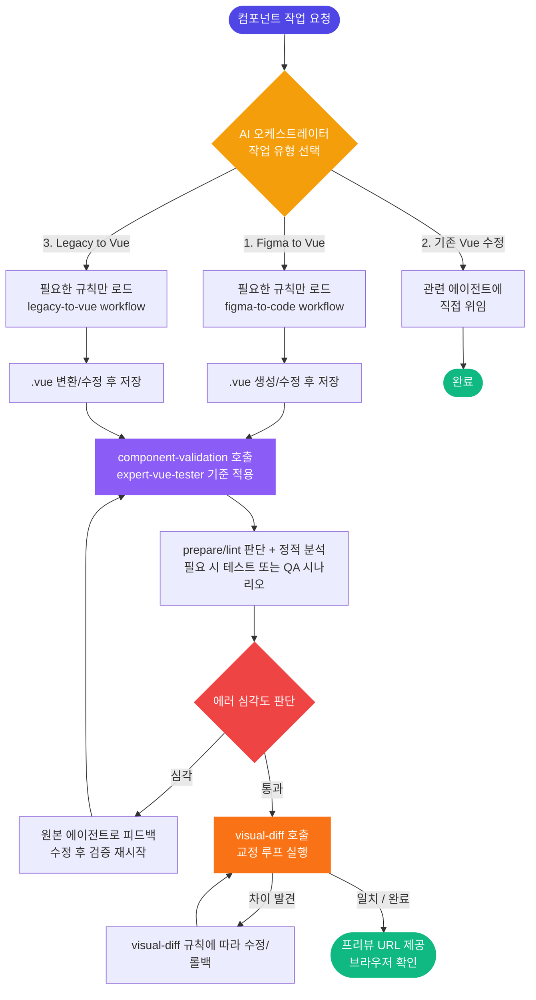

# GoodRich UXD Web-builder Setup

GoodRich Web-builder를 Figma에서 Vue 컴포넌트로 변환하고 브라우저에서 바로 확인할 수 있는 Team의 Workflow 입니다. Google Antigravity, VS Code(GitHub Copilot), Claude Code에서 사용하세요.

## 1. 처음 설치 (가장 쉬운 방법)

### 사전 준비
- `Node.js 22+`
- `npm`
- `Git`

### 설치 순서 (복붙 그대로)
1. 작업할 빈 폴더를 만들고, 그 폴더에서 터미널을 엽니다.
2. 아래 2줄을 순서대로 실행합니다. (최초 1회만)

```bash
git clone https://github.com/Hongcha-poodle/uxd-webbuilder-setup.git .
npm install
```

---

## 2. 프리뷰 서버 실행

> **`npm run dev` = 프리뷰 서버 켜기**
>
> 컴포넌트를 브라우저에서 확인하려면 이 명령어로 서버를 먼저 켜야 합니다.
> **서버는 자동으로 켜지지 않습니다.** VS Code를 열거나, 터미널을 새로 열거나, PC를 재시작할 때마다 아래 명령어를 실행하세요.

```bash
npm run dev
```

서버가 켜지면 터미널에 아래 내용이 표시됩니다:
- `localhost:3000` 주소
- 모바일 접속용 **QR 코드**
- Network IP 주소

PC 브라우저에서 아래 주소를 엽니다.

```text
http://localhost:3000
```

컴포넌트가 생성되면 아래 주소로 즉시 확인할 수 있습니다.

```text
http://localhost:3000/preview/[컴포넌트이름]
```

예: `LoginForm`이면 `http://localhost:3000/preview/LoginForm`

---

## 3. 업데이트 (워크플로우·오케스트레이터 최신화)

오케스트레이터, 에이전트 규칙, 워크플로우가 업데이트되었을 때 터미널에서 아래 명령어로 내 프로젝트에 반영합니다.  
**컴포넌트·소스 파일은 변경되지 않습니다.** `.ai/`, `.agent/`, `.github/`, `CLAUDE.md`, `AGENTS.md`만 덮어씁니다.

### Windows (PowerShell)

```powershell
Invoke-WebRequest -Uri "https://raw.githubusercontent.com/Hongcha-poodle/uxd-webbuilder-setup/main/update-windows.ps1" -OutFile "update-windows.ps1"; .\update-windows.ps1
```

또는 이미 레포를 클론한 경우:

```powershell
.\update-windows.ps1
```

### macOS / Linux

```bash
curl -fsSL https://raw.githubusercontent.com/Hongcha-poodle/uxd-webbuilder-setup/main/update-mac.sh | bash
```

또는 이미 레포를 클론한 경우:

```bash
bash update-mac.sh
```

### 업데이트되는 항목

| 경로 | 역할 |
|---|---|
| `.ai/` | 오케스트레이터·코어 규칙 |
| `.agent/` | 에이전트 워크플로우 |
| `.github/` | Copilot 지시 파일 |
| `CLAUDE.md` | Claude Code 지시 파일 |
| `AGENTS.md` | Codex 지시 파일 |

---

## 4. 디자이너가 실제로 쓰는 요청 방식

새 대화가 시작되면 AI가 먼저 아래 3가지 중 작업 유형을 묻습니다.

1. `Figma → Vue 컴포넌트 구현`
2. `기존 Vue 컴포넌트 수정`
3. `Legacy → Vue 컴포넌트 변환`

UI 컴포넌트 작업이 아니면 `해당 없음`이라고 짧게 답하고 일반 작업으로 이어가면 됩니다.

디자이너가 주면 좋은 입력:
- Figma Node URL 또는 Node ID
- 원하는 컴포넌트 이름(선택)
- 수정 포인트(예: “버튼 간격 16px로”, “카드 그림자 약하게”)

---

## 5. 결과 확인 위치

- 기본 프리뷰: `http://localhost:3000/preview/[ComponentName]`
- Visual Diff 비교용 raw 프리뷰: `http://localhost:3000/preview/raw/[ComponentName]`

### 모바일 기기에서 확인하기

컴포넌트를 실제 모바일 기기에서 바로 확인할 수 있습니다.

1. PC와 모바일을 **같은 Wi-Fi**에 연결합니다.
2. `npm run dev` 실행 후 터미널에 표시된 **QR 코드를 모바일 카메라로 스캔**합니다.
   - Network 주소(예: `http://192.168.0.10:3000`)가 함께 표시되므로 직접 입력해도 됩니다.
3. 모바일 갤러리(`/preview/mobile`)에서 컴포넌트를 탭하면 풀스크린으로 렌더링됩니다.

> **참고:** 모바일 접속도 PC에서 `npm run dev`가 실행 중이어야 합니다. 서버를 끄면 모바일에서도 접속이 끊깁니다.

---

## 6. 워크플로우 쉽게 이해하기

이 저장소의 기본 흐름은 아래처럼 단순합니다.

- 상단(노란 박스): 어떤 작업인지 먼저 선택
- 좌/우 분기: Figma 기반 생성 또는 Legacy 변환
- 보라 박스: `expert-vue-tester` 기준으로 정적 검증 진행
- 주황 박스: `visual-diff` 워크플로우 기준으로 시각 비교 교정
- 마지막 초록 박스: 확인 링크 제공

세부 실행 기준은 README에 반복하지 않고 아래 canonical 문서를 따릅니다.
- `@.agent/workflows/component-validation.md`
- `@.ai/rules/development/expert-vue-tester.md`
- `@.agent/workflows/visual-diff.md`
- `@.ai/rules/development/component-guardrails.md`

아래 flowchart는 실제 실행 순서를 요약한 것입니다.


```mermaid
flowchart TD
    Start(["컴포넌트 작업 요청"])
    Select{"AI 오케스트레이터\n작업 유형 선택"}
    Start --> Select

    Select -- "1. Figma to Vue" --> F1["필요한 규칙만 로드\nfigma-to-code workflow"]
    Select -- "2. 기존 Vue 수정" --> Direct["관련 에이전트에\n직접 위임"]
    Select -- "3. Legacy to Vue" --> L1["필요한 규칙만 로드\nlegacy-to-vue workflow"]

    F1 --> F5[".vue 생성/수정 후 저장"]
    L1 --> L6[".vue 변환/수정 후 저장"]

    F5 --> V0
    L6 --> V0
    V0["component-validation 호출\nexpert-vue-tester 기준 적용"]
    V0 --> V2["prepare/lint 판단 + 정적 분석\n필요 시 테스트 또는 QA 시나리오"]
    V2 --> V3{"에러 심각도 판단"}
    V3 -- "심각" --> V4["원본 에이전트로 피드백\n수정 후 검증 재시작"]
    V4 --> V0
    V3 -- "통과" --> VD["visual-diff 호출\n교정 루프 실행"]
    VD -- "차이 발견" --> VD1["visual-diff 규칙에 따라 수정/롤백"]
    VD1 --> VD
    VD -- "일치 / 완료" --> V6(["프리뷰 URL 제공\n브라우저 확인"])
    Direct --> Done(["완료"])

    style Start fill:#4f46e5,color:#fff,stroke:none
    style Select fill:#f59e0b,color:#fff,stroke:none
    style V0 fill:#8b5cf6,color:#fff,stroke:none
    style VD fill:#f97316,color:#fff,stroke:none
    style V6 fill:#10b981,color:#fff,stroke:none
    style Done fill:#10b981,color:#fff,stroke:none
    style V3 fill:#ef4444,color:#fff,stroke:none
```

---

## 7. 자주 쓰는 명령어만

```bash
npm run dev      # 프리뷰 서버 실행
npm run lint     # 린트 수동 확인
npm run test     # 테스트 수동 확인
```

`npm run prepare`는 validation 단계에서 필요할 때만 실행하도록 설계되어 있습니다.

---

## 8. 에셋 폴더 규칙

```text
assets/
  images/   (png, jpg, webp)
  icons/    (svg)
  fonts/    (font files)
  css/      (global css)
```
