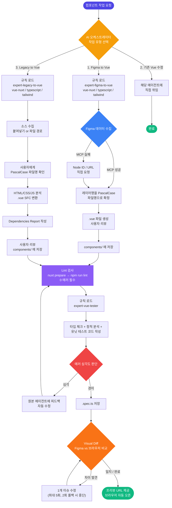

# GoodRich UXD Web-builder Setup

GoodRich Web-builder를 Figma에서 Vue 컴포넌트로 변환하고 브라우저에서 바로 확인할 수 있는 Team의 Workflow 입니다. Google Antigravity, VS Code(GitHub Copilot), Claude Code에서 사용하세요.

## 1. 처음 설치 (가장 쉬운 방법)

### 사전 준비
- `Node.js 22+`
- `npm`
- `Git`

### 설치 순서 (복붙 그대로)
1. 작업할 빈 폴더를 만들고, 그 폴더에서 터미널을 엽니다.
2. 아래 3줄을 순서대로 실행합니다.

```bash
git clone https://github.com/Hongcha-poodle/uxd-webbuilder-setup.git .
npm install
npm run dev
```

3. 브라우저에서 아래 주소를 엽니다.

```text
http://localhost:3000
```

### 설치가 끝났는지 확인
- 서버가 정상 실행되면 터미널에 `localhost:3000`가 보입니다.
- 컴포넌트가 생성되면 아래 주소로 즉시 확인할 수 있습니다.

```text
http://localhost:3000/preview/[컴포넌트이름]
```

예: `LoginForm`이면 `http://localhost:3000/preview/LoginForm`

---

## 2. 디자이너가 실제로 쓰는 요청 방식

새 대화가 시작되면 AI가 먼저 아래 3가지 중 작업 유형을 묻습니다.

1. `Figma → Vue 컴포넌트 구현`
2. `기존 Vue 컴포넌트 수정`
3. `Legacy → Vue 컴포넌트 변환`

디자이너가 주면 좋은 입력:
- Figma Node URL 또는 Node ID
- 원하는 컴포넌트 이름(선택)
- 수정 포인트(예: “버튼 간격 16px로”, “카드 그림자 약하게”)

---

## 3. 결과 확인 위치

- 기본 프리뷰: `http://localhost:3000/preview/[ComponentName]`
- Visual Diff 비교용 raw 프리뷰: `http://localhost:3000/preview/raw/[ComponentName]`

---

## 4. 워크플로우 쉽게 이해하기

- 상단(노란 박스): 어떤 작업인지 먼저 선택
- 좌/우 분기: Figma 기반 생성 또는 Legacy 변환
- 보라 박스: `lint + 타입 + 테스트` 검증
- 주황 박스: Figma와 화면을 시각 비교(자동 교정)
- 마지막 초록 박스: 확인 링크 제공

아래 flowchart는 실제 실행 순서를 그대로 보여줍니다.


```mermaid
flowchart TD
    Start(["컴포넌트 작업 요청"])
    Select{"AI 오케스트레이터\n작업 유형 선택"}
    Start --> Select

    Select -- "1. Figma to Vue" --> F1["규칙 로드\nexpert-figma-to-vue\nvue-nuxt / typescript / tailwind"]
    Select -- "2. 기존 Vue 수정" --> Direct["해당 에이전트에\n직접 위임"]
    Select -- "3. Legacy to Vue" --> L1["규칙 로드\nexpert-legacy-to-vue\nvue-nuxt / typescript / tailwind"]

    F1 --> F2{"Figma 데이터 수집"}
    F2 -- "MCP 성공" --> F3["레이어명을 PascalCase\n파일명으로 확정"]
    F2 -- "MCP 실패" --> F2a["Node ID / URL\n직접 요청"]
    F2a --> F3
    F3 --> F4[".vue 파일 생성\n사용자 리뷰"]
    F4 --> F5["components/ 에 저장"]

    L1 --> L2["소스 수집\n붙여넣기 or 파일 경로"]
    L2 --> L3["사용자에게\nPascalCase 파일명 확인"]
    L3 --> L4["HTML/CSS/JS 분석\n.vue SFC 변환"]
    L4 --> L5["Dependencies Report 작성"]
    L5 --> L6["사용자 리뷰\ncomponents/ 에 저장"]

    F5 --> V0
    L6 --> V0
    V0["Lint 검사\nnuxt prepare → npm run lint\n0 에러 필수"]
    V0 --> V1["규칙 로드\nexpert-vue-tester"]
    V1 --> V2["타입 체크 + 정적 분석 +\n유닛 테스트 코드 작성"]
    V2 --> V3{"에러 심각도 판단"}
    V3 -- "심각" --> V4["원본 에이전트에 피드백\n자동 수정"]
    V4 --> V0
    V3 -- "경미" --> V5[".spec.ts 저장"]
    V5 --> VD{"Visual Diff\nFigma vs 브라우저 비교"}
    VD -- "차이 발견" --> VD1["1개 이슈 수정\n(최대 5회, 2회 롤백 시 중단)"]
    VD1 --> VD
    VD -- "일치 / 완료" --> V6(["프리뷰 URL 제공\n브라우저 자동 오픈"])
    Direct --> Done(["완료"])

    style Start fill:#4f46e5,color:#fff,stroke:none
    style Select fill:#f59e0b,color:#fff,stroke:none
    style V0 fill:#8b5cf6,color:#fff,stroke:none
    style VD fill:#f97316,color:#fff,stroke:none
    style V6 fill:#10b981,color:#fff,stroke:none
    style Done fill:#10b981,color:#fff,stroke:none
    style V3 fill:#ef4444,color:#fff,stroke:none
    style F2 fill:#3b82f6,color:#fff,stroke:none
```

---

## 5. 자주 쓰는 명령어만

```bash
npm run dev      # 개발 서버 실행
npm run lint     # 코드 규칙 검사
npm run test     # 테스트 실행
```

---

## 6. 에셋 폴더 규칙

```text
assets/
  images/   (png, jpg, webp)
  icons/    (svg)
  fonts/    (font files)
  css/      (global css)
```
